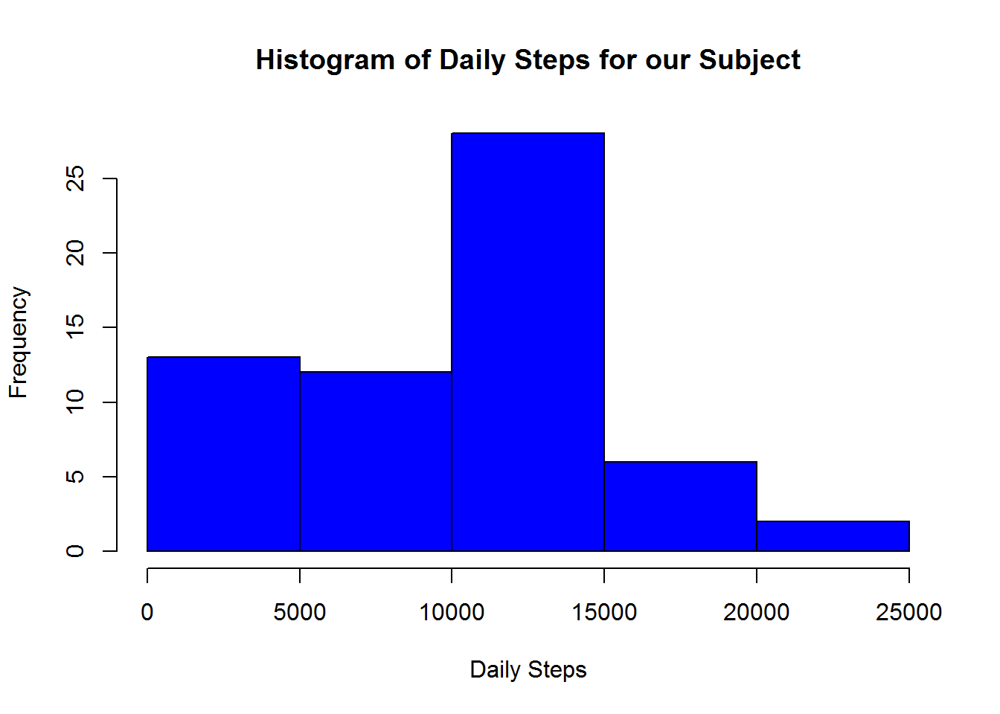
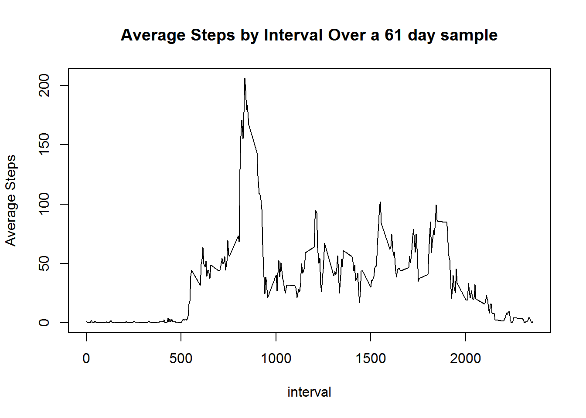
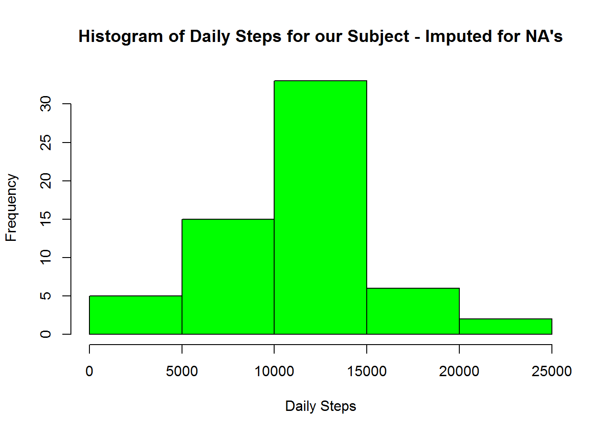
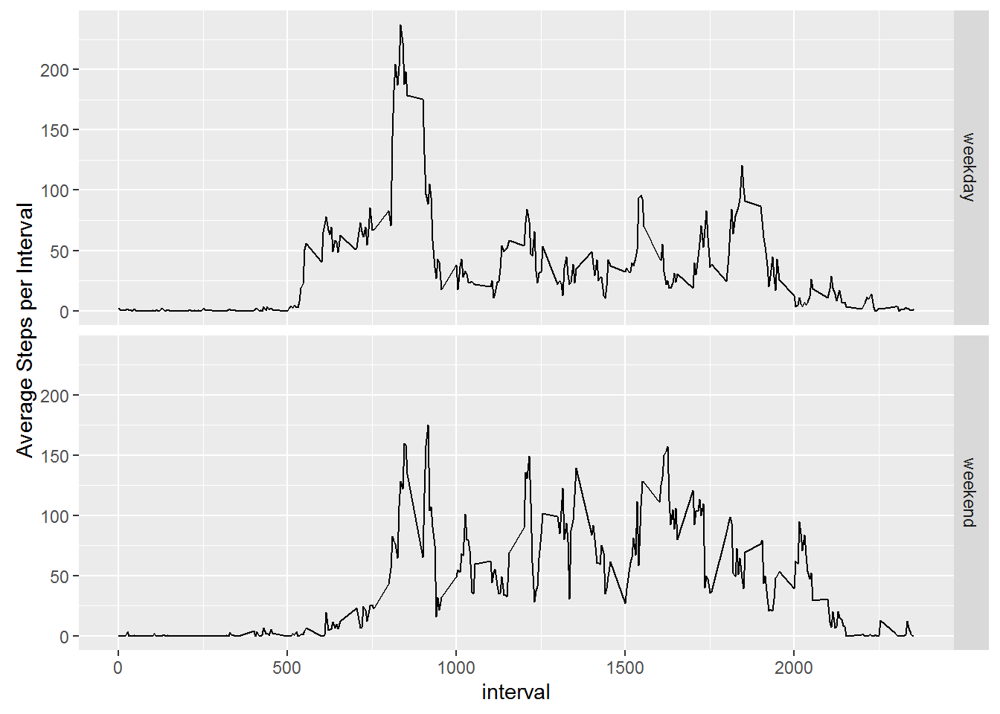

# Goal of Assignment

This project asks us to look through data from a personal activity monitoring device. This device collects data at 5 minute intervals through out the day. The data consists of two months of data from an anonymous individual collected during the months of October and November, 2012 and include the number of steps taken in 5 minute intervals each day.

## Loading and preprocessing the data

The first part of our task is to actuall load to the data.  Here's how we would proceed:

1. Unpack the file: I manually upack the csv file from the zip file in the repo.

2. Set a working directory


```r
setwd("C:/Users/Ryan/Coursera/Reproducable_Research/Week_2/RepData_PeerAssessment1")
```

3. Read the data and format the date field as a date


```r
raw_data <- read.csv("activity.csv")
raw_data$date <- as.Date(raw_data$date)
```

## What is mean total number of steps taken per day?

Note: the assignment allows us to ignore NA's.

1) Calculate the total number of steps taken per day

We can do this relatively simply by using our good friend, dplyr!!


```r
library(dplyr)
byday <- raw_data %>% group_by(date) %>% summarize(daily_total = sum(steps, na.rm=TRUE))
```

2) Make a histogram of the total number of steps taken each day

Generating a histogram is relatively easy using the base plotting system.


```r
hist(byday$daily_total, col = "blue", xlab = "Daily Steps", main="Histogram of Daily Steps for our Subject")
```



3) Calculate and report the mean and median of the total number of steps taken per day (removing duplicates)


```r
daily_mean <- mean(byday$daily_total, na.rm=TRUE)
daily_median <- median(byday$daily_total, na.rm=TRUE)
```

The daily mean number of steps is 9354.2295082 and the median number of stepes is 10395.

## What is the average daily activity pattern?

1) Make a time series plot (i.e. type = "l") of the 5-minute interval (x-axis) and the average number of steps taken, averaged across all days (y-axis)

To do this, we need to average the total number of steps taken across each five minute interval.  We can do this relatively simply by using our good friend, dplyr!!


```r
byinterval <- raw_data %>% group_by(interval) %>% summarize(interval_mean = mean(steps, na.rm=TRUE))
with(byinterval, plot(interval, interval_mean, type = "l", ylab="Average Steps", main="Average Steps by Interval Over a 61 day sample"))
```



2) Which 5-minute interval, on average across all the days in the dataset, contains the maximum number of steps?


```r
max_interval <- byinterval[which.max(byinterval$interval_mean),][1,1]
max_steps <- byinterval[which.max(byinterval$interval_mean),][1,2]
```

The interval with the largest average number of steps (with 206.1698113 steps) is 835.

## Imputing missing values

Note that there are a number of days/intervals where there are missing values (coded as NA). The presence of missing days may introduce bias into some calculations or summaries of the data.

1) Calculate and report the total number of missing values in the dataset (i.e. the total number of rows with NAs)

Complete cases will take care of this (use ! to get not complete cases or NAs).


```r
num_nas <- sum(!complete.cases(raw_data))
```

The number of observations with missing values is 2304.

2) Devise a strategy for filling in all of the missing values in the dataset. The strategy does not need to be sophisticated. For example, you could use the mean/median for that day,  or the mean for that 5-minute interval, etc.

The right way to do this is as follows:
- Look at the data as a whole to see whether or not our subject has habits (i.e. do they walk more in the morning or the evening?  Do they walk more on weekends or weekdays?)
- You would then use what you've observed as a model for your missing data
- if you have no good model, then you just use the mean (if your data doesn't have crazy outliers since the sample mean is an unbiased estimator of the actual mean) or he median (if you think that outliers in one direction or another present a real problem)

That being said, I'm going to do this the wrong way: I'm going to make something up based on antecdote because I want to implement something a little more sophisticated for the sake of the exercise.  This strategy will be based on my personal opinion (and will, coincidently, help us with the next part of the problem set).

As a proud fitbit owner, I'm going to assume that my experiences map to this given user (which is a very dumb assumption, but this isn't a real study).  I'm going to assume that this person is working age and follows a schedule.  They walk to transportation at roughly the same time every day (to and from work, to and from activities on the weekends), they follow some meeting schedule that dictates how they move around the office, and that these vary mostly by day of week and time of day.  As such, I am going to calculate the mean (because I am too lazy to look for outliers and the assignment said we could do something simpler anyway) by day of the week and time interval.  Here's how I do that (I'm forcing myself to use DPLYR for as much of this as I can for no identifiable reason):


```r
model_data <- raw_data %>% mutate(day_of_week = weekdays(as.Date(date))) %>% group_by(interval, day_of_week) %>% summarize(model_means = mean(steps, na.rm=TRUE))
```

3) Create a new dataset that is equal to the original dataset but with the missing data filled in.

To do this, we need to merge this data into the original data.  To do this, we first need to add a column to the original dataset with the weekday added.  Then, I need to merge the model_data to the raw_data based on the day_of_week and the interval.  I then need to create a new variable that is equal to the recorded data when that data is available and equal to the modeled data when that data is not available.


```r
raw_data$day_of_week <- weekdays(as.Date(raw_data$date))
merged_data <- merge(raw_data, model_data, by = c("day_of_week", "interval"))
merged_data$final_steps <- ifelse(is.na(merged_data$steps), merged_data$model_means, merged_data$steps)
```

4) Make a histogram of the total number of steps taken each day and Calculate and report the  mean and median total number of steps taken per day. Do these values differ from the estimates from the first part of the assignment? What is the impact of imputing missing data on the estimates of the total daily number of steps?

To do this, I need to sum by day and then plot.


```r
byday_imputed <- merged_data %>% group_by(date) %>% summarize(daily_total = sum(final_steps, na.rm=TRUE))
hist(byday_imputed$daily_total, col = "green", xlab = "Daily Steps", main="Histogram of Daily Steps for our Subject - Imputed for NA's")
```



## Are there differences in activity patterns between weekdays and weekends?

1) Create a new factor variable in the dataset with two levels - "weekday" and "weekend"  indicating whether a given date is a weekday or weekend day.

Fine... I'll do it


```r
merged_data$day_type <- ifelse(merged_data$day_of_week == "Saturday" | merged_data$day_of_week == "Sunday", "weekend", "weekday")
```

2) Make a panel plot containing a time series plot (i.e. type = "l") of the 5-minute interval (x-axis) and the average number of steps taken, averaged across all weekday days or weekend days (y-axis). See the README file in the GitHub repository to see an example of what this plot should look like using simulated data.

To do this, we need to first summarize the data by day_type (the variable we created to denote whether a day was a weekend or a weekday) and interval.  Once we've done this, we need to construct the panel plot.


```r
byday_type_interval <- merged_data %>% group_by(day_type, interval) %>% summarize(interval_average = mean(final_steps, na.rm=TRUE))
```

Now we plot using ggplot2.  


```r
library(ggplot2)
qplot(interval, interval_average, data = byday_type_interval, geom = "line", facets = day_type~ ., ylab="Average Steps per Interval")
```


